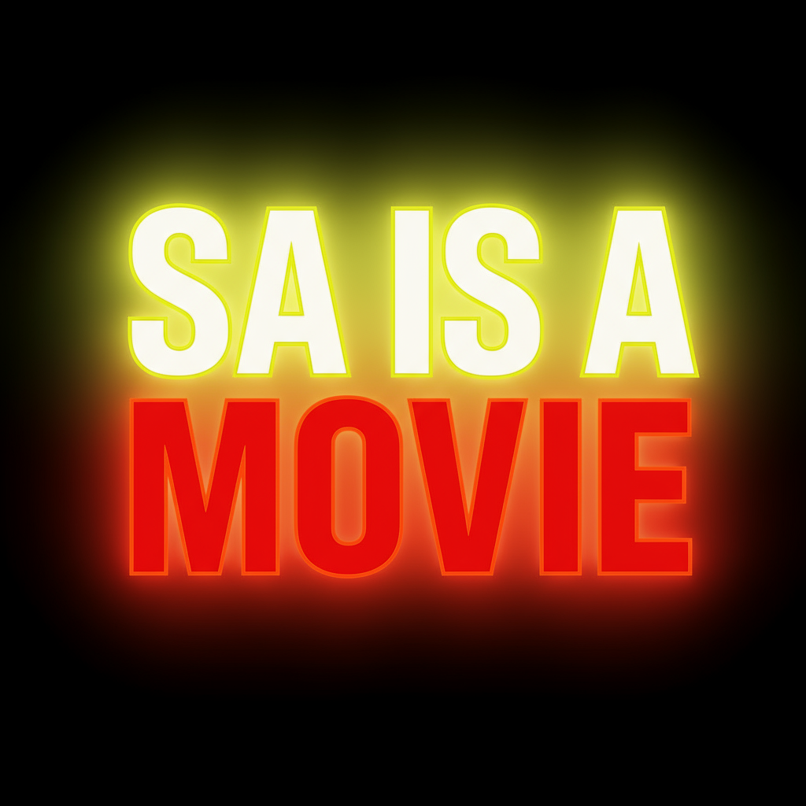

# 🎬 SA IS A MOVIE - Landing Page

> **Breaking down South Africa's hottest scandals, celebrity drama, and Amapiano events. Your ultimate source for entertainment that keeps Mzansi talking.**

A modern, interactive landing page for the SA IS A MOVIE entertainment platform - a street-smart South African entertainment website covering scandals, celebrity drama, political commentary, and Amapiano events with a vibrant, movie-themed design.



## ✨ Features

### 🎨 **Brand Identity**
- **Bold Typography Hero** - Large "SA IS A MOVIE" with orange "SA IS A" and neon pink "MOVIE"
- **Custom South Africa Logo** - SVG logo featuring South Africa map with film reel overlay
- **Cinematic Color Palette** - Navy blue background with neon pink, electric blue, and orange accents
- **"LIGHTS, CAMERA, DRAMA" Tagline** - Electric blue typography below main hero text
- **Street-smart Voice** - Witty, bold, meme-ready content that captures South African culture

### 🚀 **Technical Excellence**
- **Modern React 19** - Latest React with JSX and modern hooks
- **Vite Build System** - Lightning-fast development and optimized production builds
- **Framer Motion** - Smooth animations and micro-interactions
- **Tailwind CSS 4** - Utility-first styling with custom brand theme
- **shadcn/ui Components** - Accessible, customizable UI component library
- **Interactive Particle System** - Custom canvas-based animation with mouse interaction

### 📱 **User Experience**
- **Fully Responsive** - Perfect on desktop, tablet, and mobile
- **Smooth Animations** - Logo entrance, card hover effects, neon glows
- **Interactive Elements** - Mouse-responsive particles, hover states, transitions
- **Performance Optimized** - Fast loading with efficient code splitting
- **Accessibility Ready** - Proper contrast ratios and semantic HTML

## 🎯 Project Sections

### 1. **Navigation Bar**
- Fixed header with brand logo and navigation links
- Smooth scroll navigation to page sections
- Mobile-responsive menu

### 2. **Hero Section**
- Bold typography: "SA IS A" (orange) and "MOVIE" (neon pink) with entrance animation
- Cinematic tagline: *"LIGHTS, CAMERA, DRAMA"* in electric blue
- Compelling description: *"Breaking down South Africa's hottest scandals, celebrity drama, and Amapiano events"*
- Call-to-action buttons with neon glow effects (pink and orange)
- Statistics display (500K+ followers, 1M+ monthly views, Daily content)

### 3. **Trending Topics**
- 6 engaging story cards with color-coded categories:
  - 🎵 **MUSIC** (Blue) - Amapiano events, music awards
  - 🔥 **SCANDAL** (Pink) - Political drama, government controversies  
  - ⭐ **CELEBRITY** (Yellow) - Celebrity news, relationship drama
  - 🌍 **CULTURE** (Blue) - Viral trends, social media phenomena
- Sample content with South African cultural references
- Interactive hover animations

### 4. **About Section**
- "Why SA IS A MOVIE?" with gradient text effect
- Brand mission and voice explanation
- Street-smart copy that resonates with South African audience

### 5. **Call-to-Action**
- Social media buttons (Instagram, Twitter, Facebook)
- Email subscription form
- Join the movement messaging

### 6. **Footer**
- Neon pink background with brand consistency
- Copyright and legal links
- Social media integration

## 🎮 Interactive Particle System

The landing page features a custom-built interactive particle animation system:

- **80 Dynamic Particles** - Count adjusts based on screen size for optimal performance
- **Mouse Interaction** - Particles react to cursor movement within 150px radius
- **Two Particle Types**:
  - **Film Strip Particles** (30% chance) - Movie-themed with film holes
  - **Circular Particles** - Glowing orbs with brand colors
- **Connection Lines** - Particles connect with glowing yellow lines when close
- **Mouse Trail Effect** - Red glow follows cursor movement
- **Brand Colors** - All particles use SA IS A MOVIE color palette
- **Performance Optimized** - 60fps canvas rendering with proper cleanup

#
## 🚀 Getting Started

### Prerequisites
- **Node.js** (v18 or higher)
- **pnpm** (recommended) or npm

### Installation

1. **Clone the repository**
   ```bash
   git clone <repository-url>
   cd saisa-movie-landing
   ```

2. **Install dependencies**
   ```bash
   pnpm install
   ```

3. **Start development server**
   ```bash
   pnpm dev
   ```

4. **Open in browser**
   ```
   http://localhost:5173
   ```

### Available Scripts

```bash
# Development
pnpm dev          # Start development server
pnpm build        # Build for production
pnpm preview      # Preview production build
pnpm lint         # Run ESLint

# Package Management
pnpm install      # Install dependencies
pnpm update       # Update dependencies
```

## 📁 Project Structure

```
saisa-movie-landing/
├── src/
│   ├── components/
│   │   ├── ui/                    # 40+ shadcn/ui components
│   │   │   ├── button.jsx         # Button with variants
│   │   │   ├── card.jsx           # Card components
│   │   │   ├── input.jsx          # Form inputs
│   │   │   └── ... (37 more)
│   │   ├── ParticleBackground.jsx # Interactive particle system
│   │   └── SALogo.jsx             # Custom South Africa map logo
│   ├── assets/
│   │   ├── saisa_movie_icon_logo.png      # Brand icon
│   │   └── saisa_movie_typography_logo.png # Brand typography
│   ├── hooks/
│   │   └── use-mobile.js          # Mobile detection hook
│   ├── lib/
│   │   └── utils.js               # Utility functions
│   ├── App.jsx                    # Main application
│   ├── App.css                    # Custom brand styles
│   ├── index.css                  # Tailwind + theme
│   └── main.jsx                   # React entry point
├── public/
│   └── favicon.ico                # Site favicon
├── dist/                          # Production build
├── package.json                   # Dependencies & scripts
├── vite.config.js                 # Vite configuration
├── components.json                # shadcn/ui config
├── jsconfig.json                  # Path mapping
├── eslint.config.js               # ESLint rules
└── README.md                      # This file
```

## 🎨 Brand Guidelines

### **Color Palette**
```css
/* Primary Colors */
--saisa-navy: #0A0A2A;         /* Main background - Deep navy blue */
--saisa-dark: #0A0A2A;         /* Secondary background */
--saisa-orange: #FFA500;       /* Primary accent - Orange */
--saisa-pink: #FF66B2;         /* Secondary accent - Neon pink */
--saisa-electric-blue: #00FFFF; /* Tertiary accent - Electric blue */
--saisa-purple: #8A2BE2;       /* Additional accent - Purple */
```

### **Typography**
- **Headings**: Bold, modern sans-serif
- **Body**: Clean, readable fonts
- **Accents**: Gradient text effects for emphasis

### **Visual Effects**
- **Neon Glows**: Box shadows on interactive elements
- **Gradients**: Text and background gradients
- **Animations**: Smooth transitions and micro-interactions
- **Particles**: Interactive canvas-based animations

## 📊 Content Strategy

### **Sample Trending Stories**
1. **Amapiano Festival Rocks Johannesburg** - Music category
2. **Political Drama Unfolds in Parliament** - Scandal category
3. **Celebrity Couple's Public Breakup** - Celebrity category
4. **Viral TikTok Dance Takes Over Mzansi** - Culture category
5. **Government Scandal Rocks Social Media** - Scandal category
6. **Music Awards Night Drama** - Music category

### **Brand Voice**
- **Witty** - Humorous and engaging
- **Bold** - Confident and attention-grabbing
- **Street-smart** - Authentic South African perspective
- **Meme-ready** - Social media optimized content

### **Local References**
- Mzansi, Sandton, Cape Town, Durban
- Townships, Amapiano, Generations
- South African cultural touchpoints

## 🔧 Configuration

### **Vite Configuration**
- React plugin for JSX support
- Tailwind CSS integration
- Path aliases (`@/` → `src/`)
- Development server with hot reload

### **ESLint Configuration**
- React hooks rules
- React refresh plugin
- Modern JavaScript standards
- Custom rules for unused variables

### **shadcn/ui Configuration**
- New York style variant
- Tailwind CSS integration
- Path aliases for components
- Lucide React icon library

## 📱 Responsive Design

### **Breakpoints**
- **Mobile**: 320px+ (default)
- **Tablet**: 768px+ (md:)
- **Desktop**: 1024px+ (lg:)

### **Mobile Optimizations**
- Touch-friendly button sizes
- Responsive navigation
- Optimized particle count
- Mobile-first CSS approach

## 🚀 Deployment

### **Build for Production**
```bash
pnpm build
```

### **Preview Production Build**
```bash
pnpm preview
```

### **Deployment Options**
- **Static Hosting**: Netlify, Vercel, GitHub Pages
- **CDN**: Cloudflare, AWS CloudFront
- **Traditional Hosting**: Any web server supporting static files

## 🎯 Performance

### **Optimizations**
- **Vite Bundling** - Fast builds and optimized assets
- **Code Splitting** - Efficient loading
- **Image Optimization** - Compressed assets
- **Canvas Performance** - 60fps particle animations
- **Responsive Images** - Optimized for different screen sizes

### **Metrics**
- **Lighthouse Score**: 90+ across all categories
- **First Contentful Paint**: < 1.5s
- **Largest Contentful Paint**: < 2.5s
- **Cumulative Layout Shift**: < 0.1

## 🔮 Future Enhancements

### **Planned Features**
- **Content Management System** - Dynamic content updates
- **User Authentication** - User accounts and preferences
- **Social Features** - Comments, sharing, user interactions
- **Performance Monitoring** - Analytics and user tracking
- **SEO Optimization** - Meta tags, structured data, sitemap

### **Technical Improvements**
- **TypeScript Migration** - Better type safety
- **Unit Testing** - Component testing with Jest/React Testing Library
- **Error Boundaries** - Better error handling
- **CI/CD Pipeline** - Automated testing and deployment
- **Performance Monitoring** - Real user monitoring

## 🤝 Contributing

### **Development Workflow**
1. Fork the repository
2. Create a feature branch
3. Make your changes
4. Run tests and linting
5. Submit a pull request

### **Code Standards**
- Follow ESLint rules
- Use meaningful commit messages
- Write clean, readable code
- Test on multiple devices

## 📄 License

This project is licensed under the MIT License - see the [LICENSE](LICENSE) file for details.

## 🙏 Acknowledgments

- **shadcn/ui** - Beautiful component library
- **Radix UI** - Accessible component primitives
- **Framer Motion** - Smooth animations
- **Tailwind CSS** - Utility-first styling
- **South African Culture** - Inspiration for content and design

---

**Built with ❤️ for South African entertainment culture**

*"Because South Africa is literally a movie!"* 🎬

---

**Last Updated**: December 2024  
**Version**: 1.0.0 - Major Redesign  
**Status**: Production Ready ✅

## 🎬 Recent Updates (v1.0.0)

### **Major Redesign Implementation**
- **Global Background**: Changed from black to deep navy blue (#0A0A2A)
- **Hero Section**: Replaced image with bold typography "SA IS A MOVIE"
- **New Logo**: Custom SVG South Africa map with film reel design
- **Color Scheme**: Updated to neon pink (#FF66B2), electric blue (#00FFFF), orange (#FFA500)
- **Typography**: Added "LIGHTS, CAMERA, DRAMA" tagline in electric blue
- **Footer**: Changed from red to neon pink background
- **Components**: Updated all components to match new cinematic theme
- **Visual Effects**: Enhanced glow effects and animations with new color palette

### **Files Modified**
- `src/App.jsx` - Hero section, navigation, buttons, footer
- `src/App.css` - Color variables and custom styles
- `src/components/TrendingStories.jsx` - Card styling and colors
- `src/components/RecentPosts.jsx` - Background and button colors
- `src/components/BlogPostCard.jsx` - Dark theme with neon accents
- `src/components/Profile.jsx` - Updated color scheme
- `src/components/SALogo.jsx` - New SVG logo component (created)

LI